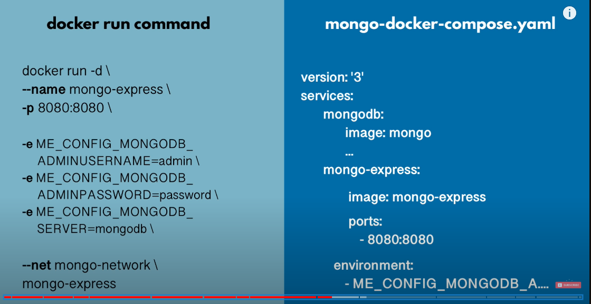
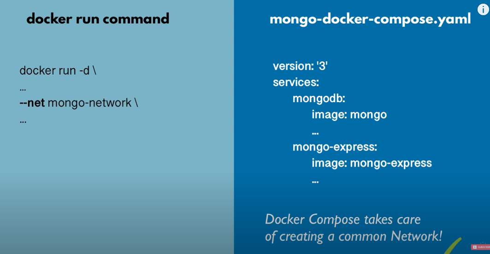

# Docker Compose!

**_AKA : RUN MULTIPLE SERVICES_**

- A real world application has a separate container for each of its services. And we know that each container needs to have a Dockerfile. It means we will have to write may be hundreds of dockerfiles and then manage everything about the containers individually, That's cumbersome.

- Hence we use docker compose,  which is a tool that helps in the definition and running of multi-container applications. With docker compose we use a single YAML file for every configuration and just single commands to start and stop all the services.

- If you are using a custom image then you will need to define its configurations in a separate Dockerfile in contrast to using a prebuilt image from **Docker Hub**, which you can define with the **docker-compose.yaml** file.

These are the features that docker compose support:

- All the services are isolated running on the single host.
- Containers are recreated only when their is some change.
- The volume data is not reset when creating new containers, volumes are preserved.
- Movement of variables and composition within environments.
- It creates a virtual network for easy interaction within the environments.

Docker Compose is discussed in demo project as well

## Docker Compose commands

```
    docker-compose -f <configured-file.yaml> up
    docker-compose -f <configured-file.yaml> down

    (here f is for file)
```

_configured-.yaml file example_



```yaml
version: "3"
services:
  # my-app:
  # image: ${docker-registry}/my-app:1.0
  # ports:
  # - 3000:3000
  mongodb:
    image: mongo
    ports:
      - 27017:27017
    environment:
      - MONGO_INITDB_ROOT_USERNAME=admin
      - MONGO_INITDB_ROOT_PASSWORD=password
    volumes:
      - mongo-data:/data/db
  mongo-express:
    image: mongo-express
    restart: always # fixes MongoNetworkError when mongodb is not ready when mongo-express starts
    ports:
      - 8080:8081
    environment:
      - ME_CONFIG_MONGODB_ADMINUSERNAME=admin
      - ME_CONFIG_MONGODB_ADMINPASSWORD=password
      - ME_CONFIG_MONGODB_SERVER=mongodb
volumes:
  mongo-data:
    driver: local
```


