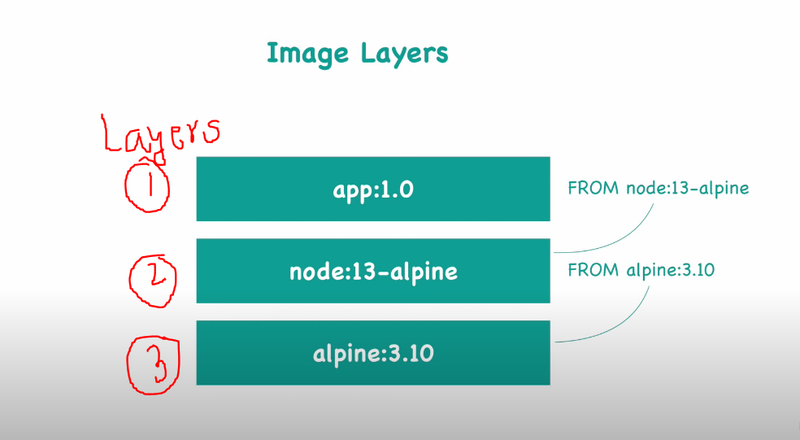

## Let's see how building process go!!

## What is DockerFile?

- Dockerfile is the image's blueprint.

### **_Step 1:_**

- Get all the services while building an image. What do I mean by this? It simply means that if we build our app on node, now while creating an image, Docker has to get the node layer in his image so after the image is produced, we can run the image, i.e. container and as we know, images are built upon layers!

```
    Commands : FROM node
    Meaning : install node
```



### **_Step 2:_**

- Set the `ENV` variables as per the need's!

### **_Step 3:_**

- `RUN` commands using run command we can execute any linux command with it

```
    command : RUN mkdir -p /home/app
    meaning : creates home/app folder inside the container
```

_Point to note : The directory will only be created inside of the container!_

### **_Step 4:_**

- `COPY` _it executes on the host machine_

```
    Command: COPY <source> <target>
    eg: COPY . /home/app
    Meaning: copy current folder files to home/app
```

### **_Step 5:_**(Entry point CMD)

- Start the app using `CMD` what it does? basically executes entry point for linux command eg: if we start our app using `node server.js` we can execute this command inside the docker file using `CMD`!

```
    command : CMD ["node", "/home/app/server.js"]
    meaning : start the app as "node server.js"
```

### **_Step 6:_**

- Finally build the app

```
    command : docker build [OPTIONS] PATH | URL | -
    eg:docker build -t my-app:1.0 .
```

### **_Step 7:_** : (open container terminal)

### **2.How to get the terminal of running container**

```
    docker exec -it "<container-Id> || <application-name:version>" /bin/bash or sh
    (it = interactive terminal)
```

- To exit out use `exit`!

---
