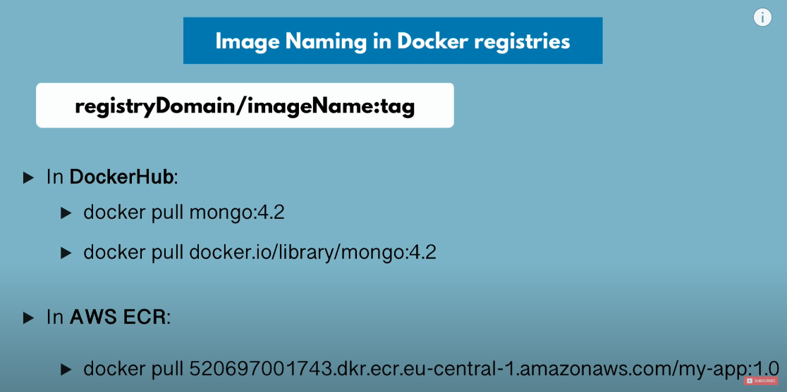

# Docker Private Repository

- There are many ways to create Private Repo but we are going to use Amazon ECR service to create one private docker repo

## Amazon ECR

1. Create AWS account
2. GO to Management Console
3. Search ECR service
4. Create a new Repo and name it,After this a URL will be given to direct to the private repo
5. It's a convention but we try to have one repo for each Image separately!
6. Now what we store in each repo is different versions of same Image!

---

## Now how to push the local Image to Amazon ECR?

**_Before Pushing we have to authenticate ourself as authorized user to the amazon ECR from locally i.e. from host_**

1. Follow the amazon commands to login in terminal commands are given in ECR!
2. Install amazon CLI and configure credentials basically follow this document for amazon CLI!

- [get-login-password](https://docs.aws.amazon.com/cli/latest/reference/ecr/get-login-password.html) (AWS CLI)

  `` aws ecr get-login-password --region `region` | docker login --username AWS --password-stdin  ``aws_account_id`` .dkr.ecr.`region`.amazonaws.com ``

- [Get-ECRLoginCommand](https://docs.aws.amazon.com/powershell/latest/reference/items/Get-ECRLoginCommand.html) (AWS Tools for Windows PowerShell)

  `(Get-ECRLoginCommand).Password | docker login --username AWS --password-stdin `aws_account_id`` .dkr.ecr.`region`.amazonaws.com ``

---

## Now the pushing Starts!!

- We can't directly push so we have to specify where we our Image to be pushed!

---

- STEP 1:(NAME)

```
    Command : docker tag(renames) <application-name:Version> <URI+/application-name:Version>

    explanation:Now it will create a new image with name like above URI
```

---

- STEP 2: (PUSH THE IMAGE WITH GENERATED IMAGE)

```
    command : docker push <GENERATED-IMAGE-NAME>
```

- It will push the image layers one by one to the amazon ECR

---

## Now if we have another version of same Image how to push that?

STEPS:

- Build a new Image
- Do the above same process again and push that
- Now the repo will have two version of same app in amazon ECR
- One more good feature is that while pushing oly new layers will be pushed again already present layers are Ignored same as pull Command

---

## Pulling from any other storage containers not from dockerHUb what happens in the background?



- In background while pulling this happens as show in the Image!
