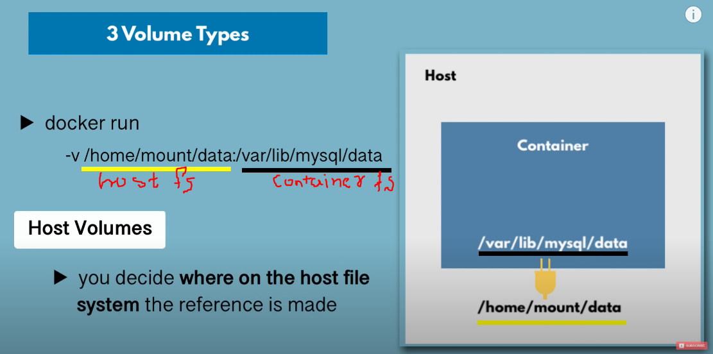
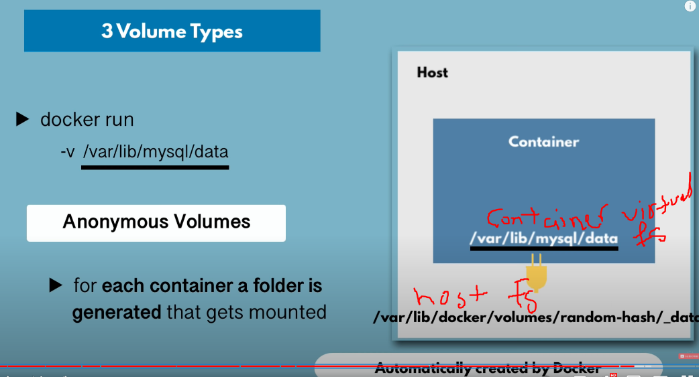
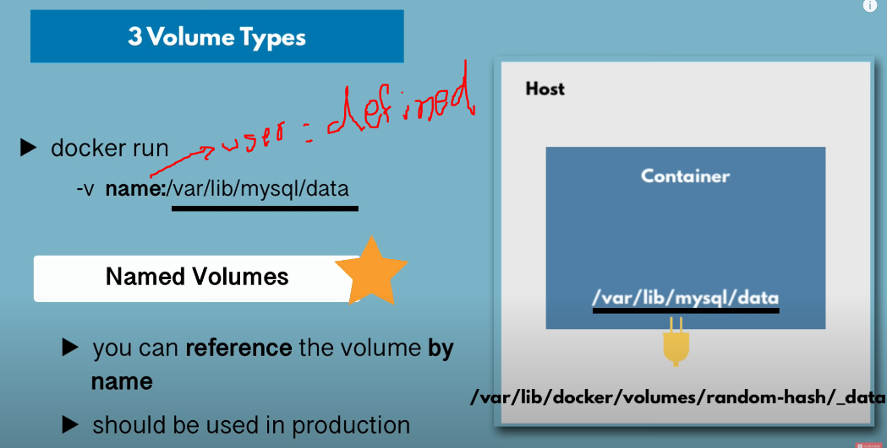
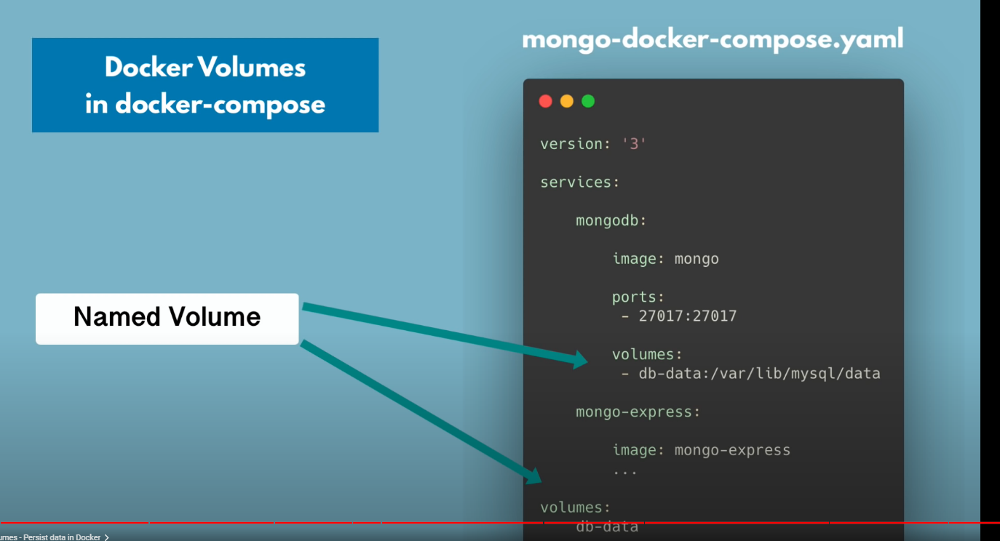

# Docker Volumes

## Why we need Docker-Volumes?

- _When we delete or stop a running container, its stored values are lost from the virtual file system. When we start a container, it has its own virtual file system, and when we stop or remove the container, it loses its virtual file system. The virtual file system has been lost, no data has been preserved and data has been lost. That's why we need a way to persist data, and we use Docker-volume for that._

## What is Docker-Volume?

_Docker volumes are a widely used and useful tool for ensuring data persistence while working in containers. Docker volumes are file systems mounted on Docker containers to preserve data generated by the running container._

- The data doesn't persist when that container no longer exists, and it can be difficult to get the data out of the container if another process needs it.
- A container's writable layer is tightly coupled to the host machine where the container is running. The data cannot be easily moveable somewhere else.
- Writing into a container's writable layer requires a storage driver to manage the filesystem.

Docker has two options for containers to store files in the host machine so that the files are persisted even after the container stops:

- Note if changes made in file while using host that will also reflect inside container!

## Docker-Volumes types

### 1. Host Volumes

### 2. Anonymous Volumes

### 3. Named Volumes(Better ver of type 2)

---

## How to configure volumes using docker-compose?

---

## Locate Docker-Volumes on Host

---
