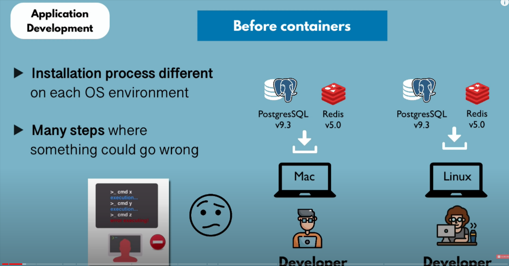
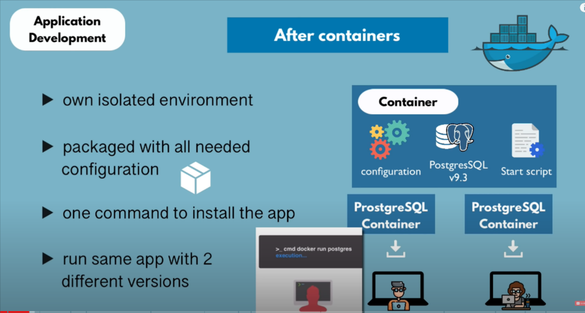
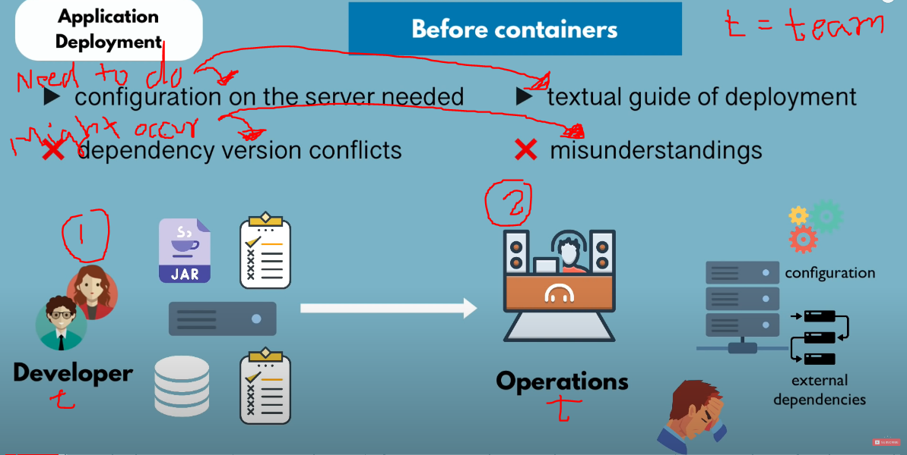
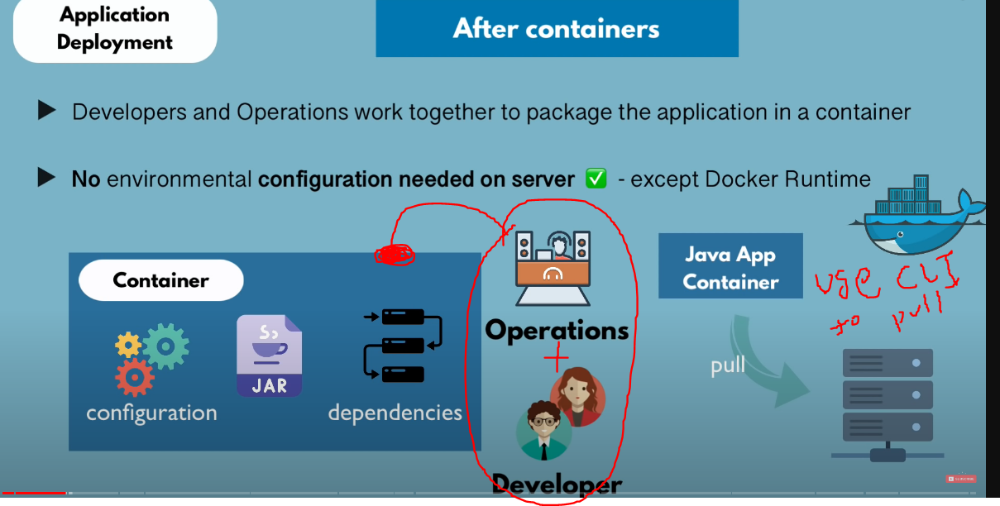

# Application Development Process!

## Before Containers.....

- Let's say we need some services(mysql,redis etc) and there are employees who work on macOS, Windows, Linux, and so on, so each service's installation process will be different on each OS.
- There might be chances of an error occurring while configuring some settings, and the old way was also time-consuming.

---

## After Containers.....

- Every service has its own isolated environment, so you just download each Docker image according to your OS environment directly.
- Every package comes with all the needed configurations.
- Simply enter one line of code in the terminal to install the app.
- We can use the same app in different versions on the same local OS environment.

---

# Application Deployment Process!

(1 Images Speaks 1000 words..)

## Before Containers.....

## After Containers

