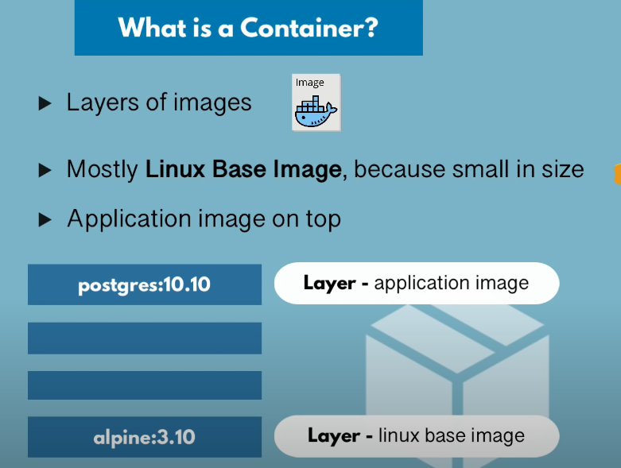
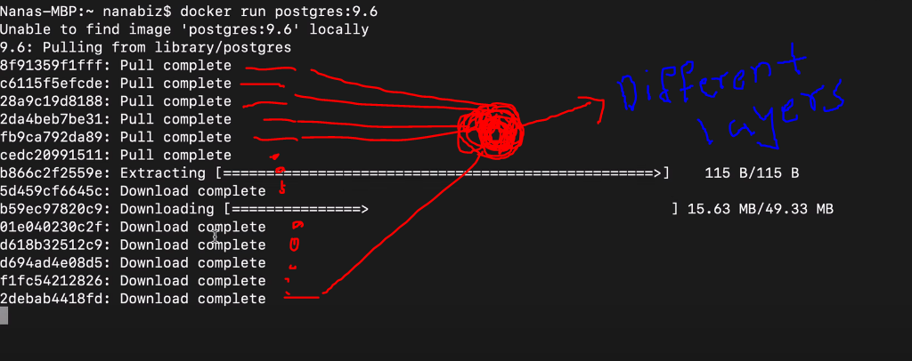
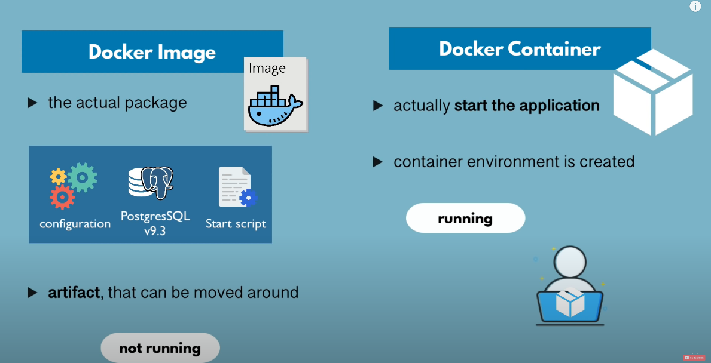

# Layers

## What is Container technically(In short):-

1. Containers are made up of Image layers on top of each other
2. At the base of most of the container we have the linux base Image,because in small size
3. Application Image on Top



### Example:Steps:-

1. Go to DockerHub
2. Search a app/service eg: postgresSQL
3. Select a version if installed directly without version then it will install the most latest version.
4. As pulling any app from public repo we don't need to login/authorize,we can directly install and use the app
5. use command :

```bash
docker run <app_name> <version>
eg: docker run postgres 9.6
```



6. We can download two diff versions of docker app and run then at the same time in one local environment.

---

NOTE: When installing a certain app from docker of 2 different version, if certain layer already exists then It will not download the layer again this feature is very useful as it save both time and space...

---

Docker Image vs Docker Container




