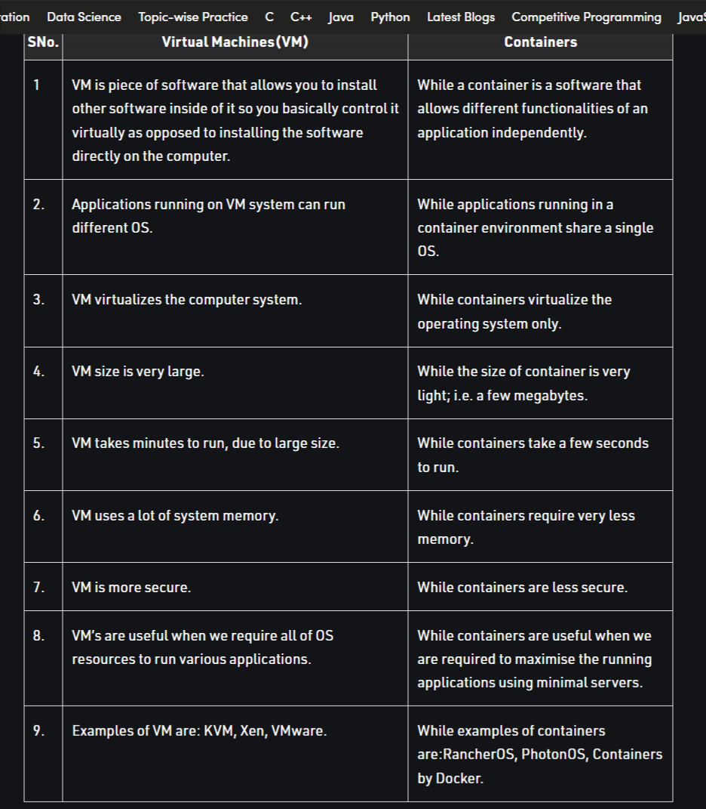

# Difference between Container and Virtualization

Virtual machines and Containers are two ways of deploying multiple, isolated services on a single platform.

**[Virtual Machine](https://www.geeksforgeeks.org/virtual-machines-in-operating-system/):**\
It runs on top of an emulating software called the hypervisor which sit between the hardware and the virtual machine. The hypervisor is the key to enable virtualization. It manages the sharing of physical resources into virtual machines. Each virtual machine runs its own guest operating system. They are less agile and have low portability than containers.

**Container:**\
It sits on the top of a physical server and its host operating system. They share a common operating system that requires care and feeding for bug fixes and patches. They are more agile and have high portability than virtual machines.

