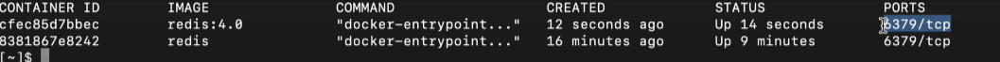
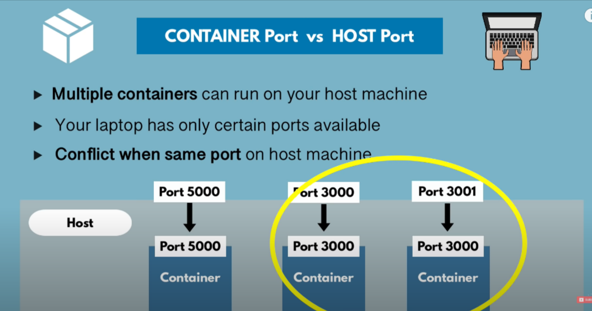

# Container-PORT and Host PORT

- So when we run a container, it listens to a certain port.
- The host only has one port, which is mapped to the virtual container port number and the host port number, for example, if Redis container is listening on port 6379 it will be mapped with host's port 6379 by default!



- Now Why do we care about this?
  - Let's say we want to run the same application in two different versions. If we start them parallelly, they will run simultaneously but will listen to the same port only, which can lead to conflicts that we don't want.
  ```
  eg: redis -> 6379
  eg: redis:4.0 -> 6379
  here they are listening to same port only
  ```
  - How do we solve this we cannot change the container port in this case 6379 PORT but we can `map` certain HOST port eg `6000->6379` for `redis:latest` and `6001->6370` for `redis:4.0`



```
some-APP://localhost:3001
```

## How to do map the ports?

- Step One- (use command and flag `-p`)

```
docker run -p6001:6379 redis
```

- Step Two- (Check If executed properly or not)

```
docker ps
```

Note: if we run any application and try to map with `6000` port then it will throw an error as the port is already reserved
