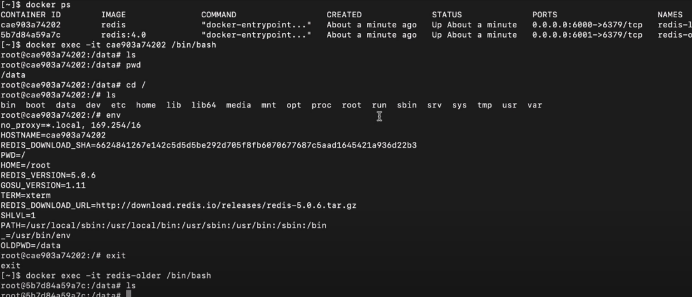

## Debugging-Docker

### **1.How to check logs of certain container**

SYNTAX:

```
    docker logs <application-name> || <container-Id>
```

### **2.How to Name your Containers**

(Here the Name and application-name are diff use command `docker ps` and the last column what we want ot change)
SYNTAX:-

```
    docker run --name <new-name> <application-name> -(this will create a new container with new name!)
```

note we can use this will logging out details of certain container!

### **2.How to get the terminal of running container**

- What do you mean by this? We simply believe it means that each container has its own directory, and that we can use this command to check the log file or navigate between the directories of that running container to access the container terminal.

```
    docker exec -it "<container-Id> || <application-name:version>" /bin/bash
    (it = interactive terminal)
```

after this we will be change to root user for that running container!

Point to Note: IT has limited commands to execute only eg. curl is NA...

- To exit out use `exit`!


