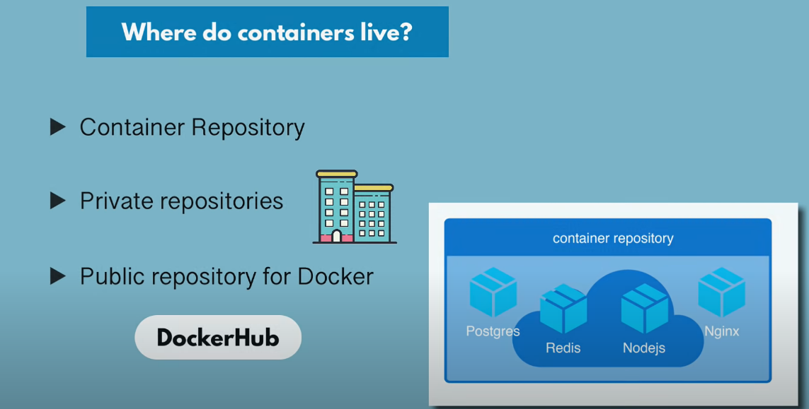

# What is containerization?

Containerization is a software deployment process that bundles an application's code with all the files and libraries it needs to run on any infrastructure. Traditionally, to run any application on your computer, you had to install the version that matched your machine's operating system. For example, you needed to install the Windows version of a software package on a Windows machine. However, with containerization, you can create a single software package, or container, that runs on all types of devices and operating systems.

## What are the benefits of containerization?

- Developers use containerization to build and deploy modern applications because of the following advantages.

### Portability

Software developers use containerization to deploy applications in multiple environments without rewriting the program code. They build an application once and deploy it on multiple operating systems. For example, they run the same containers on Linux and Windows operating systems. Developers also upgrade legacy application code to modern versions using containers for deployment.

### Scalability

Containers are lightweight software components that run efficiently. For example, a virtual machine can launch a containerized application faster because it doesn't need to boot an operating system. Therefore, software developers can easily add multiple containers for different applications on a single machine. The container cluster uses computing resources from the same shared operating system, but one container doesn't interfere with the operation of other containers.

### Fault tolerance

Software development teams use containers to build fault-tolerant applications. They use multiple containers to run microservices on the cloud. Because containerized microservices operate in isolated user spaces, a single faulty container doesn't affect the other containers. This increases the resilience and availability of the application.

### Agility

Containerized applications run in isolated computing environments. Software developers can troubleshoot and change the application code without interfering with the operating system, hardware, or other application services. They can shorten software release cycles and work on updates quickly with the container model.

---

## What are containerization use cases?

- Cloud migration
- Adoption of microservice architecture
- IoT devices

## What are the types of container technology?

- Docker:(Docker, or Docker Engine, is a popular open-source container runtime that allows software developers to build, deploy, and test containerized applications on various platforms. Docker containers are self-contained packages of applications and related files that are created with the Docker framework.)

- Linux :(Linux is an open-source operating system with built-in container technology. Linux containers are self-contained environments that allow multiple Linux-based applications to run on a single host machine. Software developers use Linux containers to deploy applications that write or read large amounts of data. Linux containers do not copy the entire operating system to their virtualized environment. Instead, the containers consist of necessary functionalities allocated in the Linux namespace.)

- Kubernetes:(Kubernetes is a popular open-source container orchestrator that software developers use to deploy, scale, and manage a vast number of microservices.)

## Where do Container Lives?

So as containers are portable, we can store and move them around easily. They can be strangled in the following ways:

1. **Container Repository** :- Special type of repo where containers are stored.
2. **Private Repository** :- The company/Orgs stores their containers or privately hosts the repo.
3. **Public Repository** :- Docker's official website provides Containers. If official containers for any services are available on the site, users can download them.

---

- REFERENCE :-
  - Techworld with nana(https://youtu.be/3c-iBn73dDE)
  - GFG
  - AWS
  - Docker
  - Random Sites
